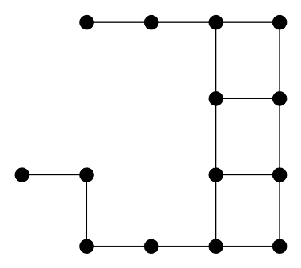

reference paper available [here](https://arxiv.org/abs/1805.08531) <d-cite key="gossip"></d-cite>

Framework (gossip problem): Given a network of agents represented as a graph, in which each agent holds a real value, we want to estimate the average of these values in a distributed manner. The agents (nodes) are related through links (edges), which they can use to communicate.

The authors build a method for solving this problem that depends only on what they define as the *spectral dimension of the network*, which is intuitively the dimension of the space in which the agents live (for the grid in $$\mathbb{Z}^n$$, the spectral dimension is $$n$$). Their method shows improvement over previous algorithms in the non-asymptotic regime, when the values are far from fully mixed.

## The gossip problem and gossip algorithms

### The gossip problem
The gossip problem, also known as the averaging problem, is fundamental in distributed frameworks, when information is shared among several machines without a central server. In this framework, we assume that each machine can communicate only with a few others, and these links are represented in a graph $$G=(V,E)$$. Each machine hold an initial real value that the others do not know. The goal is then to find a way to get each machine to know the average of these initial values, through an iterative communication procedure and as quickly as possible.

#### Problem Setting
We are given an undirected finite graph $$G=(V,E)$$, where $$V$$ is the set of agents (nodes) in the network, and $$E$$ the set of communication links (edges). Each node $$v\in V$$ receives an initial real value $$\xi_v$$ called an observation. We denote by $$\xi=(\xi_v)_{v\in V}$$ the vector of observations, and the goal is then for each machine to know $$\bar\xi=\frac{1}{|V|}\sum_{v\in V}\xi_v$$ through an iterative algorithm.

$$x^t=(x^t_v)_{v\in V}$$ denotes the values at time $$t$$.

NB : we are in in a synchronous framework, meaning that at every time step, all communciations are made at the same time (and not successively)

### First gossip algorithms

#### Simple gossip

Referred to as *simple gossip* in the paper, the landmark algorithm consists in the following intuitive scheme: at each iteration, each agent replaces his current value by an average of the values held by its neighbors. Formally, this means that we have a **gossip matrix** $$W$$, which is stochastic, symmetric, nonnegative and supported by the graph : $$W_{u,v}>0\implies \{u,v\}\in E$$.

Usual gossip matrices :
- in a $$d$$-regular graph (all vertices have degree $$d$$): $$W$$
- more generally, if all vertices have degree smaller than $$d_{\max}$$: $$W$$

Then the simple gossip algorithm consists in the updates $$x^{t+1}=Wx^t$$. So $$x^t=W^t\xi$$

#### Shift-register gossip

The idea of this second gossip algorithm is to take a linear combination of past iterates :
$$x^{t+1}=\omega Wx^t+(1-\omega)x^{t-1}$$ with $$x^0=\xi$$ and $$x^1=W\xi$$
Without going into the details of this algorithm, it is clear that the parameter $$\omega$$ plays an important role and must be finetuned. It was shown in other papers (CITE?) that $$\omega=2\frac{1-\sqrt{\gamma(1-\gamma/4)}}{(1-\gamma/2)^2}$$, which depends on the spectral gap gamma, works well, with an acceleration of convergence for small gammas (compared to simple gossip).

This is a nice improvement since $$\gamma$$ is indeed very small in large graphs. And in practicle cases, graph networks are quite big so it is a worthy improvement.

Yet one important point here is that **we assume that all agents know the spectral gap** $$\gamma$$. But in the general case, there is no reason why they should. Thus, the point of this paper is to find a way to avoid this difficulty by building a method based not on $$\gamma$$ but on the spectral dimension of the graph.

## Acceleration with Jacobi Polynomials

### Polynomial gossip

Intuitively, polynomial gossip consists in replacing $$x^t=W^t\xi$$ by $$x^t=P_t(W)\xi$$. In other words, at every time step, we take linear combinations of all past iterates of the simple gossip method.

with $$\text{deg}P_t\leq t$$ (to ensure that the $$x^t$$ can be computed using at most $$t$$ communication steps) and $$P_t(1)=1$$ (to ensure that if all initial observations are equal, then $$x^t=\xi$$ for any $$t$$).

[matrices diagonalisées]

